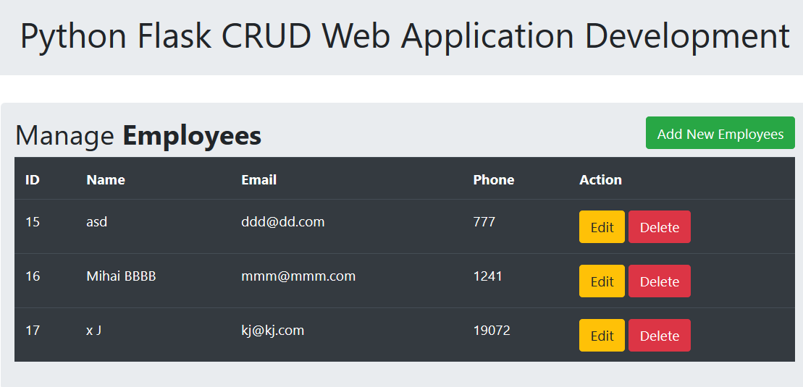

# Employees Web-App

##### This is a web application for a company in which you can create an employee, read employee data from PostgreSQL database, update employee data and also delete employee.

#### For this project I only used Flask and PostgreSQL.

#### To run this app install all the required dependencies from the requirements.txt file with ** pip install -r requirements.txt **.

